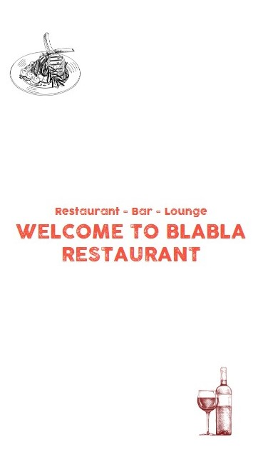

# BlaBla Restaurant Web Page

> Prototype of a restaurant web page

## Built With

- HTML, CSS, JS
- SCSS, Bootstrap

## Live Demo

[Live Demo Link](https://damdafayton.github.io/restaurant/)

## Getting Started

Download and click `index.html`.

## Authors

👤 **Author1**

- GitHub: [@damdafayton](https://github.com/damdafayton)
- LinkedIn: [/in/damdafayton](https://linkedin.com/in/damdafayton)

## 🤝 Contributing

Contributions, issues, and feature requests are welcome!

Feel free to check the [issues page](../../issues/).

## Show your support

Give a ⭐️ if you like this project!

## Acknowledgement

Original design idea by [Cindy Shin in Behance](https://www.behance.net/adagio07).

## 📝 License

This project is [MIT](./MIT.md) licensed.